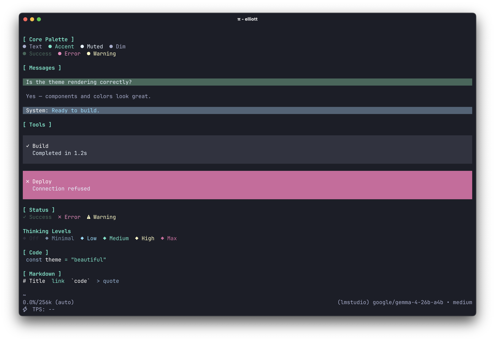
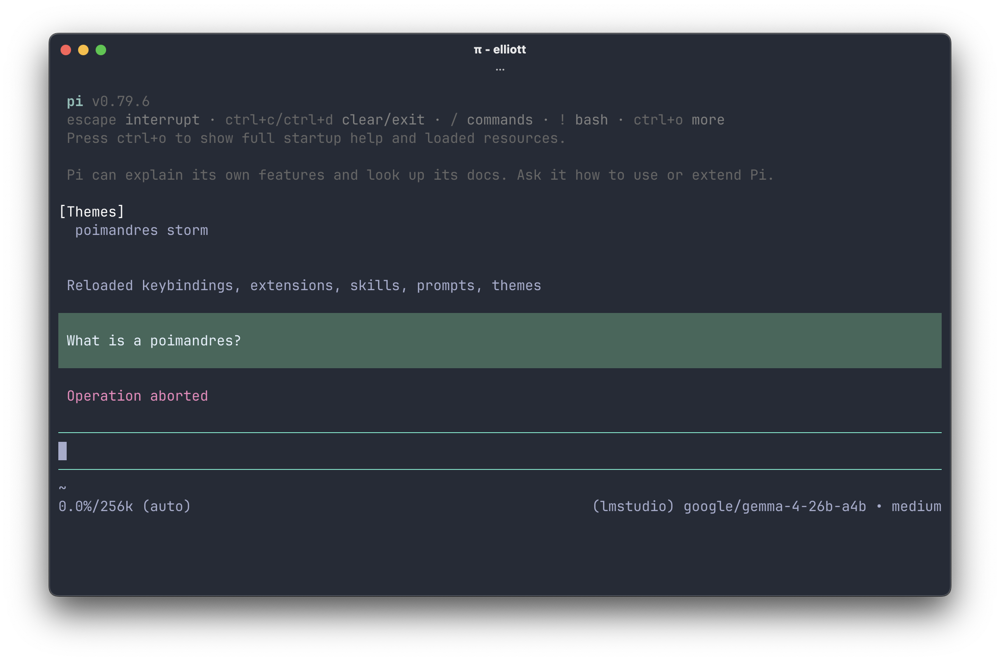
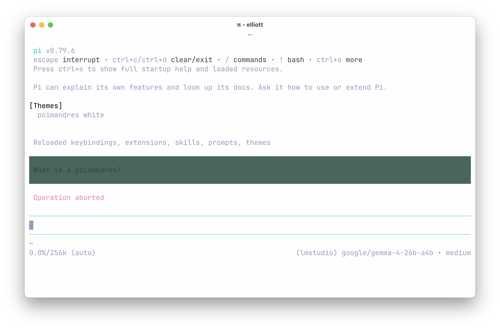

<div align="center">
  
  <h1>poimandres-pi</h1>
</div>

<p align="center">
  <a href="https://www.npmjs.com/package/@llttlltt/poimandres-pi">
    
  </a>
</p>

<p align="center">
  <a href="https://github.com/earendil-works/pi/tree/main">Pi Coding Agent</a> theme based on the <a href="https://github.com/drcmda/poimandres-theme">Poimandres VSCode theme</a>.
</p>

<table>
  <tr>
    <td align="center"><strong>poimandres</strong></td>
    <td align="center"><strong>poimandres storm</strong></td>
    <td align="center"><strong>poimandres white</strong></td>
  </tr>
  <tr>
    <td align="center"></td>
    <td align="center"></td>
    <td align="center"></td>
  </tr>
</table>

## Installation

```bash
# From npm
pi install npm:@llttlltt/poimandres-pi

# From git
pi install git:github.com/llttlltt/poimandres-pi
```

Then select a theme via `/settings` or in your `settings.json`:

```json
{
  "theme": "poimandres"
}
```

Available theme names: `poimandres`, `poimandres storm`, `poimandres white`.

To try without a permanent install:

```bash
pi -e npm:@llttlltt/poimandres-pi
# or
pi -e git:github.com/llttlltt/poimandres-pi
```

## Development

The theme files in `themes/pi/` are generated from the upstream [poimandres-theme](https://github.com/drcmda/poimandres-theme) VS Code source, which is included as a git submodule at `poimandres-theme/`.

### Setup

> **Note:** `--recurse-submodules` is required. Without it the upstream theme source will be missing and the build will fail.

```bash
git clone --recurse-submodules https://github.com/llttlltt/poimandres-pi.git
cd poimandres-pi
pnpm install
pnpm build

# Verify the generated themes are correct
pnpm test:generated
```

### Commands

| Command | Purpose |
|---|---|
| `pnpm build` | Regenerate themes (lint, type-check, unit tests, and clean as a prebuild step) |
| `pnpm verify` | Lint, type-check, unit tests, and clean — without building |
| `pnpm lint` | Fix formatting and lint issues via Biome |
| `pnpm test` | Unit & extraction tests |
| `pnpm test:generated` | Verify generated themes after a build |

## 🙌 Related

- [poimandres-theme](https://github.com/drcmda/poimandres-theme): VSCode version
- [poimandres-terminal](https://github.com/alii/poimandres-terminal): macOS / iTerm / Windows Terminal version
- [poimandres.nvim](https://github.com/olivercederborg/poimandres.nvim): Neovim version
- [poimandres.zed](https://github.com/mshaugh/poimandres.zed): Zed version
- [poimandres-alacritty](https://github.com/z0al/poimandres-alacritty): Alacritty version
- [poimandres-iterm](https://github.com/alii/poimandres-iterm): iTerm version
